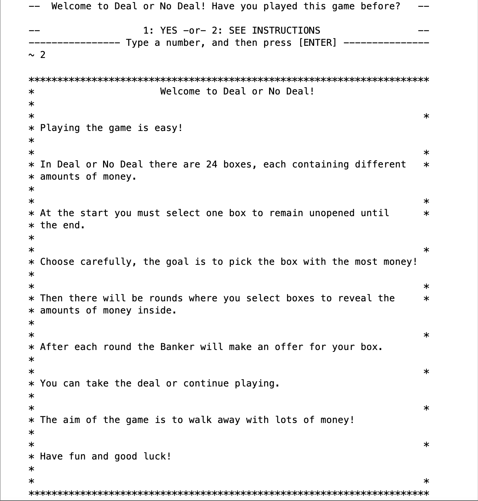

# DealOrNoDealCLI

## Project Description
The purpose of this project was to create a Command-Line User Interface (CUI) version of a Deal Or No Deal game. 
The code to create the game needed to be clear, well-designed and follow Object-Oriented Programming practices. The game interface had to be easy for users to interact with. The code also had to successfully input and output data to/from text files, as well as easily handle user input from the Command Line. The class structure needed to be clear and contribute to the complexity and robsutness of the functionality.

## Gameplay

#### *Scenario 1: Normal input, winning the game*

An input of 2 from the user would call game instructions stored in a text file to the screen. An input of 1 would begin the game. An input of 1 would begin the game.

The user can choose their first case by inputing any number from 1-24 (the available number of cases). After choosing thier first case the user must eliminate all other cases remaining, accepting or declining offers made by the Banker.

The game will continue until the cases are gone, or until the user accepts an offer. In this case, the user has accepted an offer from the Banker with an amount of money larger than the amount within the users chosen case from the beginning of the game. 
The game outcome is then send to a text file to be saved.

#### *Scenario 2: Invalid input, error handling*

If the user inputs a number for a case that has already been eliminated, a message will simply appear on screen, informing the user that the chosen number case is unavailable and to try again.

#### *Scenario 3: Rejecting all game offers, losing the game*

If the first case the user chose was worth less money than the offers made by the Banker, the user will lose the game. Again, the game outcome is then send to a text file to be saved.

## Developers:
- Grace Subianto [(gracesubianto)](https://github.com/gracesubianto)
- Mridula Manderwad [(mmridulzz)](https://github.com/mmridulzz)

